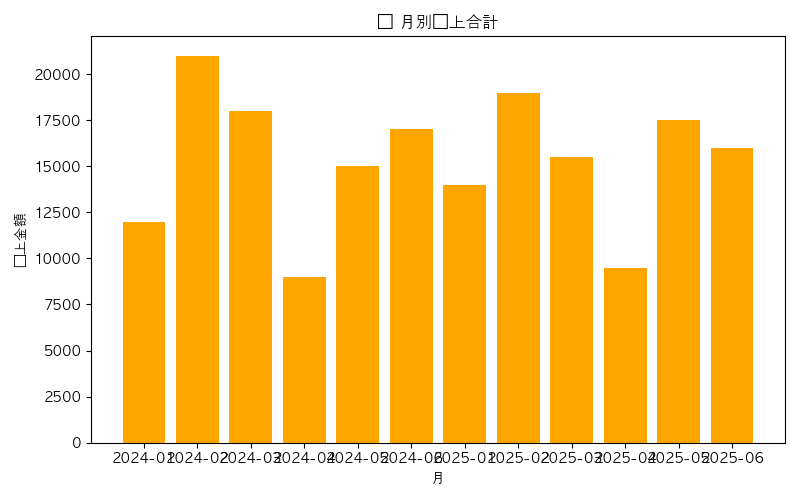

# Python Sales Automation System

Pythonを使って  
**売上データ集計 → グラフ生成 → HTMLレポート化 → Slack通知 → ログ管理 → 定期実行**  
までを自動化した、実務想定の業務改善ツールです。

Excelでの手作業集計や属人化を想定し、  
「失敗しても追える」「毎日自動で回せる」設計を重視しています。

## 🔹 What I built
- pandasでCSV売上データを集計・分析
- matplotlib / Plotly によるグラフ自動生成
- HTMLレポートの自動生成
- Slack（Block Kit）で結果通知
- Logging + ローテーションによる実行ログ管理
- GitHub Actions による定期自動実行

👉 **日次業務の自動化を想定した実装**

## 📸 Output Samples

## 📌 Overview（できること一覧）

このシステムは、売上CSVを読み取り、以下の処理を自動で行います。

- ✔ **売上集計（pandas）**
- ✔ **上位売上ランキング抽出**
- ✔ **折れ線グラフ / 棒グラフ生成（matplotlib / Plotly）**
- ✔ **HTMLレポート生成**
- ✔ **Slack通知（Block Kit 対応）**
- ✔ **ログ出力 / ローテーション管理（logging）**
- ✔ **スケジュール自動実行（GitHub Actions）**

---

## 🛠 技術スタック

| カテゴリ | 使用技術 |
|----------|-----------|
| 言語 | Python 3.x |
| データ処理 | pandas |
| 可視化 | matplotlib / Plotly |
| Web | Flask（ミニアプリ） |
| 通知 | Slack API（Block Kit） |
| CI/CD | GitHub Actions（自動実行） |
| その他 | dotenv / JSON設定管理 / logging |

---

## 📊 出力サンプル

- sales_line_chart.png  
- sales_monthly_chart.png  
- top_sales_plot.html  

（※ GitHub Pages を利用して公開可能）

---

## 📁 Project Structure

python-practice/
├── auto_sales_report.py # メイン自動化スクリプト
├── sales_total.py # 売上集計
├── high_sales.py # 上位売上抽出
├── generate_index.py # HTMLレポート生成
├── logger_setup.py # ログ設定モジュール
├── slack_notifier.py # Slack通知
├── mail_sender.py #（拡張用）メール通知
├── outputs/ # グラフ/HTMLの出力
├── data/ # 売上CSV
└── README.md

---

## 🚀 Main Features（主要機能）

### 1. **売上データ集計（pandas）**
- 日次・月次の売上を集計  
- 売上ランキングを抽出  
- 数値整形

### 2. **グラフ生成（matplotlib / Plotly）**
- 折れ線グラフ（売上推移）
- 上位10件ランキング（Plotlyでインタラクティブ表示）
- 月次別売上棒グラフ

### 3. **HTMLレポート出力**
- `generate_index.py` でレポートを自動生成  
- グラフ画像を一覧化  
- GitHub Pages にアップロード可能

### 4. **Slack通知（Block Kit）**
- 成功通知（color=good）
- 警告（warning）
- エラー（danger）
- 情報（info）←追加

### 5. **ログ管理（logging + RotatingFileHandler）**
- 毎回の実行ログ / エラーログを保存  
- ローテーション設定で自動整理  

---

## 🔄 自動実行

GitHub Actions により  
**毎日決まった時間にレポートを自動生成 → Slack に通知される構成** にできます。

---

## 🧩 Sample Workflow

auto_sales_report.py
├─ load CSV
├─ sales_total()
├─ high_sales()
├─ generate graphs
├─ create index.html
├─ send Slack notification
└─ write logs

---

## 📚 Strengths（制作の強み）

-Python初学ながら、**日常作業を自動化する実務レベルの構成** を意識して設計  
-Slack Block Kit / logging / HTML / CI など幅広い技術を1つのプロジェクトに統合  
-見やすいようにコードを細かくモジュール分割  
-異常検知・通知・ロギングにより **エラー耐性の高い構成** を実現  

---

## 🧪 Main Projects

### **1. 売上自動化ツール（本プロジェクト）**

日次〜月次の売上データを自動集計し、グラフ化・HTMLレポート化・Slack通知まで一気通貫で処理する基幹ツールです。

- pandas + matplotlib + Plotly を利用した売上の完全自動化  
- Slack通知 ＋ HTML化で閲覧性を向上  
- GitHub Actions を利用し「毎日自動」まで実現可能

---

### **2. Flask ミニアプリ（拡張）**

Flask を使った簡易Webアプリで、テンプレート・API連携・ログ処理などWeb基礎を体系的に学ぶために構築しました。

- HTMLテンプレートを使用したフォームアプリ  
- API連携（天気API）を実装  
- ログ管理・例外処理などを学習

---

### **3. Error Practice Logs（トラブルシューティング）**

開発中に発生した実際のエラーを再現・記録し、原因分析と改善策をメモした“エラー対策の成長ログ”です。

- 実際に発生したエラーを再現・記録  
- 対応策をメモした学習ログ  
- これによりエラー耐性を強化

---

## 🎯 Goals

このプロジェクトは、エンジニア転職に向けて  
**「現場で役立つ自動化ツールを作れること」** を目標に構築しました。

- 日次・月次業務を効率化するデータ集計ツールを作成できる力をつける  
- Slack通知・ログ管理など、実務で使われる技術の基礎を固める  
- Flask を使って Web アプリの基礎（テンプレート・API・例外処理）を習得する  
- GitHub Actions を利用し、継続的な自動化ワークフローを構築できるようになる  

最終的には、**業務改善ツールを自走して作れるエンジニア** を目指しています。

---

## 💬 Mindset

> 「限られた時間でも必ず継続し、着実にスキルを積み上げる」  
> 「ChatGPT を活用し、効率的に学びながら“自走できるエンジニア”を目指す」

---
## 🧑‍💻 About Me / いっせー

39歳からプログラミング学習を再開し、  
**“積み上げれば人生は変えられる”** を軸に継続しています。

タクシードライバーとして不規則な勤務の中、  
明けの日・公休にまとめて学習するスタイルで、  
限られた時間でも **必ず前回の続きから取り組める仕組み** を作り、着実にスキルを積み上げています。

ChatGPT を活用しながら、  
データ集計・可視化・HTMLレポート生成・Slack 通知・ログ管理・Flask など  
**“実務で使われる技術” を取り入れた自動化ツールの開発** を進めています。

エンジニア転職では、  
**業務改善ツールを自走して作れるエンジニア**  
として価値を発揮することを目指しています。

---

## 📩 Contact

- GitHub: https://github.com/taxi208  
- プログラミング学習仲間・エンジニア志望の方、ぜひご連絡ください🔥

---

## 🔧 今後の拡張（Next Steps）

- Plotlyのグラフを全レポートに拡張  
- Slack通知のメッセージ改善（成功/警告/エラー/情報）  
- logger_setup.py のハンドラー改善  
- settings.json を導入して設定分離  
- GitHub Actions 分単位スケジュール化  
- HTMLテンプレートのデザイン改善

---

## ⭐ Special Thanks

ChatGPT と協力しながら、毎日の積み上げで作り上げました。

## 📌 Next Tasks（次回やることリスト）

### 1. GitHub プロフィール強化（優先度：高）
- GitHub プロフィール README を作成する（自己紹介を書く）
- プロフィール画像・バナー画像を設定する
- python-practice リポジトリへのリンクを載せる
- 転職エンジニア用に「何ができるか」を簡潔にまとめる

### 2. GitHub ポートフォリオ整理
- 他の練習用 Python プロジェクトをリポジトリとして整理する
- サムネイル画像を追加できるものは追加する
- リポジトリの Description（説明文）と Topics を統一感あるものに整える
- README のフォーマットを他のリポにも横展開する

### 3. 次のミニプロジェクト案（どれでもOK）
- Flask（または FastAPI）でミニAPIを作る
- pandas × matplotlib で「売上以外」のデータを使った分析ノートを作る
- 数分で動く簡易自動化ツール（CSV整形、フォルダ整理など）を作る
- GitHub Actions を使った自動処理をもう1つ追加する

### 4. 転職用ストーリー作成（面接・職務経歴書用）
- 「39歳からの再挑戦」パートを書く
- 「なぜ Python／自動化に方向性を決めたか」
- 「python-practice で学んだ技術（箇条書きでOK）」
- 「この先どんなエンジニアになりたいか」
- 面接でそのまま話せる 60秒自己紹介を作る

### 5. 明日のスタート地点
- VSCode を開いたら、この Next Tasks を見て着手する
- まずは GitHub プロフィール README を作るところからスタートする

---

## 📝 Memo
- 次回：GitHubプロフィールREADME作成（転職用の顔）
