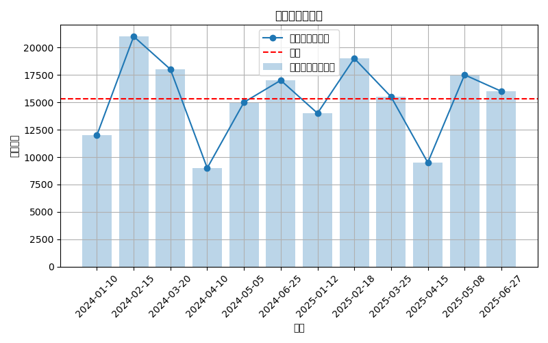

# python-practice

このリポジトリは、Python を使った売上データの集計と可視化の練習用です。  
日別売上をグラフ化し、平均線・ランキング出力・合計/平均の算出まで行いました。

## 使用技術
- Python 3.9
- pandas
- matplotlib

## 実行方法
```bash
python3 sales_total.py
## 出力例
- sales_chart.png : 日別売上の折れ線グラフ
- high_sales.csv : 売上が指定値以上の日を抽出したCSV
- sales_line_chart.png : 売上データを折れ線グラフで表示したもの（平均線つき）
print("合計売上:", df["売上"].sum())
# Python Practice

このリポジトリは、売上データを使った Python 学習の成果をまとめたものです。  

## 売上データの可視化（新機能）
- 日別売上データを折れ線グラフ＋棒グラフで表示  
- 平均売上を赤い破線で表示  



上記のグラフにより、売上の傾向や平均を一目で把握できるようになりました。

feat: add sales visualization with mean line
### 可視化結果
- 棒グラフ：各月の売上
- 折れ線：売上推移
- 赤線：平均売上


---

### 📊 前年比較グラフの追加 (2024 vs 2025)

`python3 sales_total.py` を実行すると、以下のファイルも生成されます：

- `sales_compare_year.png`  
  → 2024年と2025年の**月別売上を棒グラフで比較**し、成長傾向を可視化  
  → 平均線も表示され、前年との伸びが一目で分かります  

例：  


---

### 今後の拡張予定
- 成長率（前年比％）の算出  
- 月別ランキングCSV出力  
- Plotlyによるインタラクティブグラフ化  

# 📊 Sales Data Visualization

このプロジェクトでは、Python を使って売上データを可視化しました。  
`pandas` でデータを読み込み、`matplotlib` と `plotly` でグラフを作成しています。

---

## 🔧 使用ツール
- Python 3
- pandas
- matplotlib
- plotly
- GitHub Pages

---

## 🚀 実行内容
1. `sales_data.csv` を読み込み  
2. 月別・日別売上グラフを作成  
3. Plotly版の動くグラフをHTML出力  
4. GitHub PagesでWeb公開  

📈 公開ページ：  
👉 [日別売上グラフ（Plotly版）](https://taxi208.github.io/python-practice/sales_plot.html)

---

## 📈 グラフサンプル


## 🧩 今後の予定
- 月別平均グラフの追加  
- 高売上ランキングの自動抽出  
- READMEに画像サンプル追加

---

## ✍️ Author
**isseyrickowens**  
Python練習・副業開発の記録用リポジトリ

